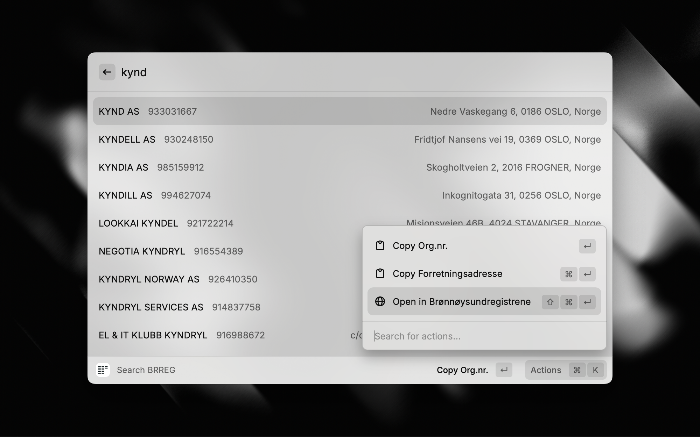

# Brreg Search

Search Norwegian companies from the Central Coordinating Register for Legal Entities (Enhetsregisteret). Find companies by name or organisation number, view details, and keep favourites close at hand.

## What it does

Search for Norwegian companies directly from Raycast. View company details, financial information, and locations. Save favourites for quick access. All data comes from the official [Brønnøysund Register Centre (Brreg)](https://www.brreg.no) API.

## Quick start

Type a company name or 9-digit organisation number in the search bar.

**Examples:**
- `Equinor` — search by name
- `916880286` — search by organisation number (must be exactly 9 digits)
- `DNB` — partial name search

## Search rules

- **Name search**: Type any part of a company name. Results update as you type.
- **Organisation number**: Must be exactly 9 digits. Incomplete numbers (fewer than 9 digits) won't trigger a search.

## Favourites

Favourites are stored locally on your device using Raycast's local storage. They appear above search results and are hidden while you're typing.

**Managing favourites:**
- **Add**: `⌘F` from search results or company details view
- **Remove**: `⌘⇧F` from search results or company details view
- **Customise emoji**: Choose from predefined categories (⭐ Star, 🏦 Bank, 📈 Growth, 🧪 Test, 🛍️ Retail, 🧑‍💻 Tech, 🏗️ Construction, 🏥 Health, 🍽️ Food, ⚙️ Industry) or set a custom emoji
- **Automatic favicon**: Company website favicons are detected and displayed automatically
- **Reorder**: Enable move mode with `⌘⇧M`, then use `⌘⇧↑` and `⌘⇧↓` to reorder favourites

## Company details

View detailed company information in three tabs:

- **Overview**: Description, contact information, organisation number, address, employee count, industry classification (NACE codes), VAT and audit status, founding date, last filing date
- **Financials**: Latest accounting year's revenue, EBITDA, operating result, net result, total assets, equity, total debt, depreciation, and audit status
- **Map**: Company location using OpenStreetMap tiles with a link to Google Maps for directions

**External links:**
- Open company in Brønnøysundregistrene website
- Search for company in Proff.no

## Keyboard shortcuts

**Search & Navigation**
- `Enter` — View detailed company information
- `⌘⇧↵` — Open company in Brønnøysundregistrene
- `⌘←` — Go back from company details

**Favourites**
- `⌘F` — Add to favourites
- `⌘⇧F` — Remove from favourites
- `⌘⇧M` — Toggle move mode for reordering
- `⌘⇧↑` — Move favourite up (move mode active)
- `⌘⇧↓` — Move favourite down (move mode active)

**Copy actions**
- `⌘⇧C` — Copy organisation number
- `⌘⇧B` — Copy business address
- `⌘⇧R` — Copy revenue
- `⌘⇧N` — Copy net result

**Tabs**
- `⌘1` — Switch to Overview tab
- `⌘2` — Switch to Financials tab
- `⌘3` — Switch to Map tab
- `Backspace` — Previous tab

## Privacy & networking

**Data sent to external services:**
- **Brreg API** (`data.brreg.no`): Search queries (company name or organisation number) and organisation numbers for company details
- **Brreg Regnskapsregisteret** (`data.brreg.no/regnskapsregisteret`): Organisation numbers to fetch financial data
- **Nominatim** (`nominatim.openstreetmap.org`): Company addresses for geocoding (to display maps)
- **OpenStreetMap tiles** (`tile.openstreetmap.org`): Tile coordinates for map display
- **Favicon service** (via `@raycast/utils`): Company website URLs to fetch favicons for favourites

**Data stored locally:**
- Favourites list (company data including organisation number, name, address, and optional emoji/favicon) stored in Raycast's local storage on your device

**External links (no data sent):**
- **Google Maps**: Directions links (opened in your browser)
- **Proff.no**: Search links (opened in your browser)
- **Brønnøysundregistrene**: Company detail pages (opened in your browser)

No user credentials, API keys, or personal data are required or collected. All data is used solely to provide search results and company information.

## Requirements

No credentials or API keys required. Brreg provides open, free access to its Enhetsregisteret endpoints. Map functionality uses free OpenStreetMap services (Nominatim for geocoding, tiles for map display). Directions link to Google Maps without requiring an API key.

## Feedback

Feature requests and issues: [GitHub repository](https://github.com/kyndig/brreg-search)

Made with 🫶 by [kynd](https://kynd.no)
